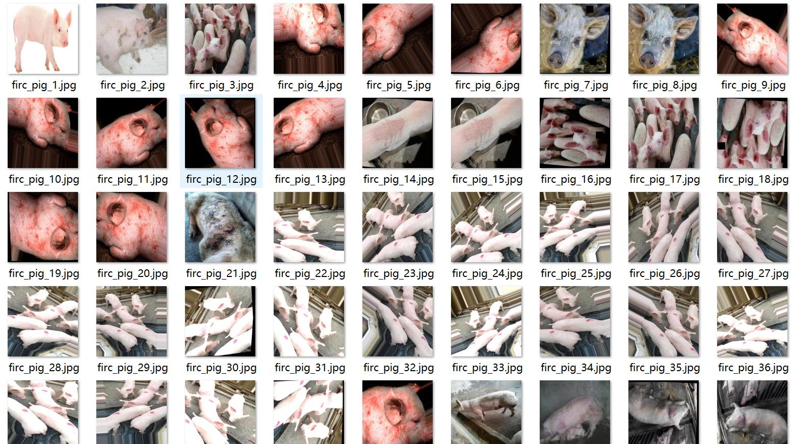
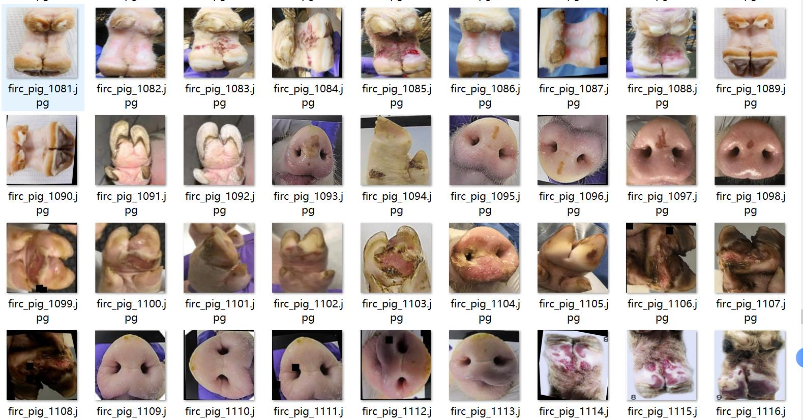

# Intelligent Pig Disease Detection Dataset VOC+YOLO Format, 1462 Categories

Attention: The dataset contains a large number of rotated enhanced images.
Dataset format: Pascal VOC format + YOLO format (txt files without split paths, only containing jpg images and corresponding VOC format xml files and YOLO format txt files)
Number of images (number of jpg files): 1462
Number of annotations (number of xml files): 1462
Number of annotations (number of txt files): 1462
Number of annotation categories: 8
Annotation category names (note that the order of categories in the YOLO format does not correspond to this, but is based on the labels folder classes.txt): ["healthy", "infected_bacterial_erysipelas", "infected_bacterial_greasy", "infected_environmental_sunburn", "infected_fungal_ringworm"]
"infected_parasitic_mange","infected_viral_foot_and_mouth","swine_pox"]  
boxes per class:   
Healthy box count = 821
Infected bacterial erysipelas box count = 81
Infected bacterial greasy box count = 154
Infected Environmental Sunburn (Environmental Burn) Box Count = 48
Infected Fungal Ringworm (Fungus Infection Ringworm) box count = 151
Infected Parasitic Mange (Parasitic Mange) box count = 97
Infected Viral Foot and Mouth (Viral Foot and Mouth Disease) box count = 360
Swine Pox (Porcine Pestiferous Disease) box count = 244
total boxes: 1956  
images per class:   
healthy_images = 549  
infected_bacterial_erysipelas_images = 78  
infected_bacterial_greasy_images = 144  
infected_environmental_sunburn_images = 43  
infected_fungal_ringworm_images = 86  
infected_parasitic_mange_images = 86  
infected_viral_foot_and_mouth_images = 250  
swine_pox_images = 226
image resolution: 640x640  
Using an annotation tool: labelImg
Annotation rules: For the class, draw a rectangle box.
Important notes: The dataset does not have a division of training, validation, and test sets; you need to divide it yourself.
Special statement: This dataset does not guarantee any accuracy for the trained model or weight files.
Image preview:
## Images

Here is a pay link on Stripe ( https://buy.stripe.com/3cs8yP7sY87d0vu9AB ). Please contact me lonlonago@foxmail.com after funding $89, and I will send you a complete data files , thank you!

